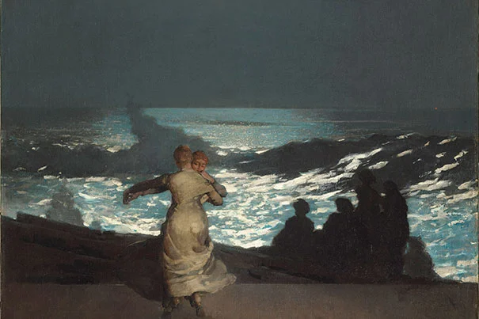
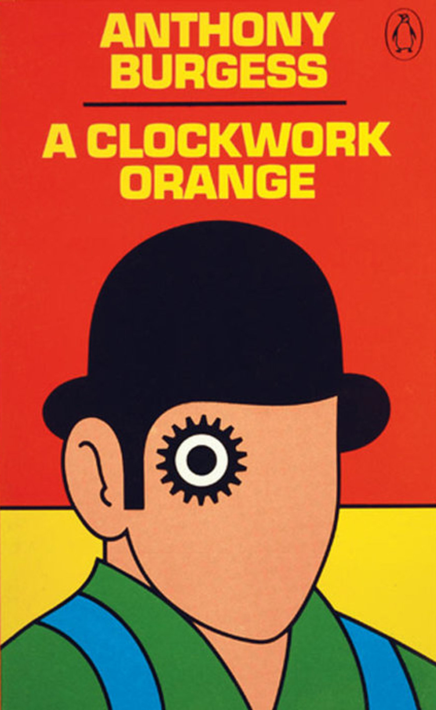
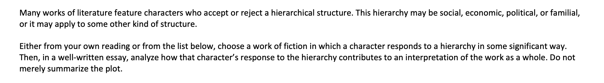
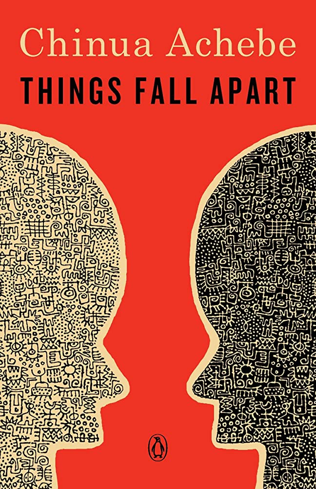
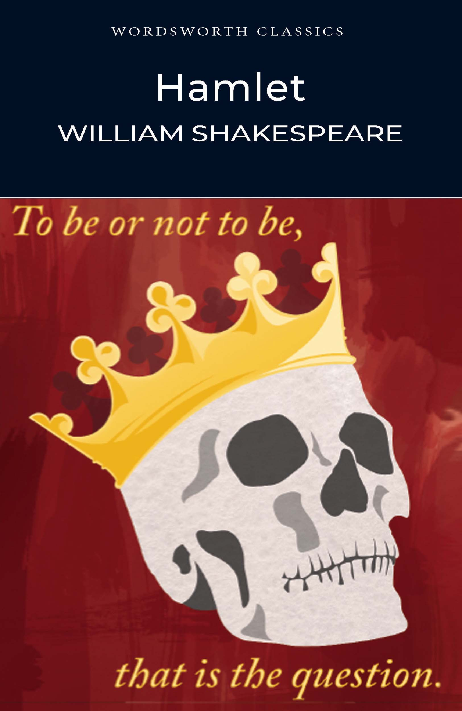

# Literary Argumentation
 or how I learned to love Q3

 

###### *nolan pestano*

---

# What is Literary Argumentation :interrobang: 

---

# How does this help describe a character ?

motives, persuasion, character development

---

# How do you answer Q3
#### don't summarize, analyze and *interpert* what the books is arguing
### ***KNOW YOUR BOOKS***

---

# Example Time :fire:

---

# **Potential Books**

---
# wrap it up 
### ***ANSWER THE PROMPT***

